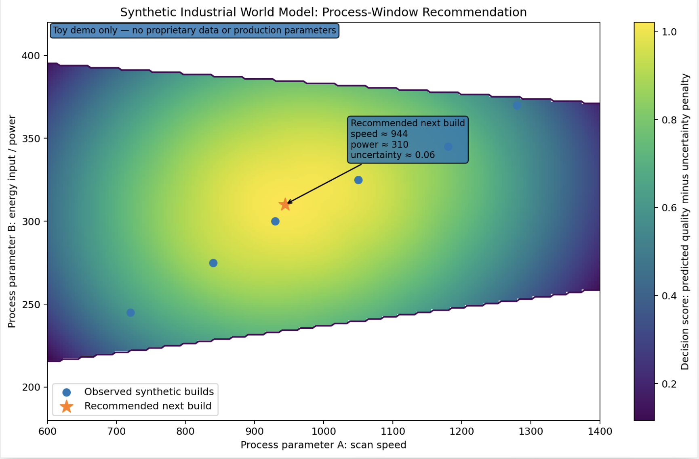

# Programmable Manufacturing Lab

[](https://github.com/programmablemanufacturing/programmable-manufacturing-lab/releases/tag/v0.1-industrial-world-model)

Open research and community infrastructure for **industrial world models**, Physical AI decision layers, and programmable manufacturing.

Latest release: [v0.1-industrial-world-model](https://github.com/programmablemanufacturing/programmable-manufacturing-lab/releases/tag/v0.1-industrial-world-model)

## Quick start

```bash
cd benchmarks/toy-process-window/industrial-world-model
pip install -e ".[dev]"
python examples/run_demo.py
pytest
```

## Download

A packaged public snapshot of the Industrial Manufacturing World Model v0.1 is available from the GitHub Releases page:

- [industrial-world-model-v0.1.zip](https://github.com/programmablemanufacturing/programmable-manufacturing-lab/releases/download/v0.1-industrial-world-model/industrial-world-model-v0.1.zip)

This package contains synthetic, non-proprietary examples for education, benchmarking, and community contribution.


Foundation models generate information. Physical industries need systems that can make better decisions under real-world constraints.

This repository explores how manufacturing teams can move from trial-and-error process development toward **physics-grounded decision systems** that reason about process states, uncertainty, experiments, qualification requirements, and physical feedback.



*Example output from the synthetic industrial world model demo.*

The initial technical focus is an open scaffold for **industrial world models**: lightweight abstractions that represent manufacturing as a state-transition process under physics constraints, sparse data, and evolving process observations.

> How can manufacturing move from trial-and-error process development toward programmable physical decision-making?
---

## Why this exists

Many AI projects in manufacturing fail before the model itself becomes the bottleneck.

The issue is often not simply model accuracy. It is that:

- the operational problem is not clearly defined
- the data trail is inconsistent
- the process variables are not well structured
- the decision point is unclear
- model outputs are not connected to real engineering or operator action

A useful AI system for manufacturing therefore needs more than a model.

It needs a way to connect:

```text
industrial context
        ↓
process definition
        ↓
data + physics priors
        ↓
prediction / evaluation
        ↓
decision recommendation
        ↓
physical feedback
```

This repository focuses on that missing interface between AI systems and real manufacturing decisions.

---

## Core idea

Traditional AI systems mostly operate in information environments.

Manufacturing systems operate in the physical world, where decisions must respect:

- material behavior
- equipment constraints
- process variability
- measurement limitations
- cost of experimentation
- safety and qualification requirements

This creates a need for a **Physical AI Decision Layer**: a system layer that helps translate data, physics, constraints, and feedback into actionable process decisions.

The long-term vision is **programmable manufacturing**: manufacturing systems that can be reasoned about, adapted, and improved through structured decision workflows instead of repeated trial-and-error.

---

## What this repository contains

This repository contains public-facing, generalized, and synthetic materials for research, education, and community discussion.

This repository currently includes and will continue expanding:

- Manufacturing AI readiness scorecards
- Process-mapping templates
- Pilot-definition templates
- Toy physics-AI benchmarks
- Synthetic process-window examples
- Notes on Physical AI and programmable manufacturing
- Discussion prompts for researchers, engineers, and builders

The goal is to make it easier for the community to reason about:

- when AI is useful in manufacturing
- when a process is ready for predictive modeling
- what information is needed before optimization makes sense
- how physics priors and data-driven models can complement each other
- how better predictions can connect to real process decisions

---

## Public artifacts

### 1. Manufacturing AI Readiness Scorecard

A lightweight framework for evaluating whether a manufacturing process is ready for an AI-assisted pilot.

Example dimensions:

- Problem clarity
- Measurability
- Process stability
- Controllability
- Feedback loop
- Decision relevance

The goal is to distinguish between:

- interesting AI idea
- almost ready
- pilot ready
- not yet ready

---

### 2. Process Mapping Template

A simple template for translating a manufacturing problem into a structured decision problem.

Example questions:

- What is the operational bottleneck?
- What inputs can be controlled?
- What outputs can be measured?
- What process states are observable?
- What decision would change if prediction improved?
- What feedback is available after the decision?

---

### 3. Toy Physics-AI Benchmarks

Small synthetic examples for exploring how physics priors and data-driven models interact.

These examples are intentionally simplified. They are designed for education, discussion, and benchmarking.

Possible examples include:

- sparse-data regression with a known physical trend
- process-window search under constraints
- uncertainty-aware recommendation
- synthetic process-structure-property mapping
- toy inverse-design problem

### Industrial Manufacturing World Model v0.1

The toy process-window benchmark now includes a minimal runnable industrial world model scaffold:

```text
process history + controllable action
    -> predicted next process state
    -> uncertainty estimate
    -> feasibility / defect risk
    -> recommended next process action

See:
benchmarks/toy-process-window/industrial-world-model/

The implementation is synthetic and non-proprietary. It is designed for public education, benchmarking, and community contribution, and does not include industrial partner data, sensitive process parameters, or production optimization logic.
---

### 4. Physical AI Decision Layer Notes

Short public notes on concepts such as:

- why manufacturing AI often fails before modeling
- what makes physical decision-making different from digital automation
- why sparse data is common in high-value manufacturing
- how physics priors can reduce search space
- what “programmable manufacturing” could mean as a category

---

## Repository structure

```text
programmable-manufacturing-lab/
│
├── README.md
├── CONTRIBUTING.md
├── LICENSE
│
├── docs/
│   ├── decision-layer-primer.md
│   ├── glossary.md
│   ├── manufacturing-ai-readiness.md
│   ├── physical-ai-stack.md
│   └── programmable-manufacturing.md
│
├── templates/
│   ├── readiness-scorecard.md
│   ├── process-mapping-template.md
│   └── pilot-definition-template.md
│
├── benchmarks/
│   ├── toy-process-window/
│   ├── README.md
│   └── industrial-world-model/
│       ├── README.md
│       ├── pyproject.toml
│       ├── requirements.txt
│       ├── examples/
│       ├── notebooks/
│       ├── src/imwm/
│       └── tests/
│   
│
└── community/
    ├── contribution-ideas.md
    ├── discussion-prompts.md
    └── roadmap.md
```

Not all folders may be populated yet. The repository is being built in public.

---

## Start here

If you are new to the project, start with:

1. `docs/manufacturing-ai-readiness.md`  
   A practical framework for evaluating whether a manufacturing process is ready for an AI-assisted pilot.

2. `templates/process-mapping-template.md`  
   A simple template for converting an operational manufacturing problem into a structured decision problem.

3. `benchmarks/toy-process-window/`  
   A synthetic benchmark for exploring process-window recommendation under constraints.

---

## Who this is for

This project may be useful for:

- manufacturing engineers
- materials scientists
- AI researchers
- robotics and automation builders
- industrial data teams
- students working on physics-informed AI
- founders exploring Physical AI or industrial AI systems

You do not need access to real production data to participate.

The goal is to build public artifacts that help the community discuss, test, and improve the interface between AI and physical production systems.

---

## How to contribute

Contributions are welcome in several forms.

### Good first contributions

- suggest a missing readiness criterion
- improve the process-mapping template
- propose a toy benchmark
- add a simple synthetic dataset
- write a short note on a manufacturing AI failure mode
- open an issue with a use case or question
- improve documentation clarity

### Useful discussion topics

- What makes a manufacturing process “AI ready”?
- When do physics priors help more than additional data?
- What does a useful decision layer need to output?
- How should uncertainty be communicated to engineers?
- What is the smallest useful Physical AI pilot?
- How can open benchmarks be useful while remaining safe and general?

---

## Community roadmap

The near-term roadmap is:

- Improve the Industrial Manufacturing World Model v0.1 package
- Add clearer quick-start examples for new contributors
- Add a notebook comparing physics-only, data-only, and world-model planning baselines
- Add additional synthetic manufacturing environments
- Add uncertainty calibration diagnostics
- Collect feedback from manufacturing engineers and AI researchers
- Expand good first issues around benchmarks, metrics, and documentation
---

## Guiding principles

### 1. Start from the decision, not the model

A model is only useful if it changes a real decision.

### 2. Use physics where data is sparse

Many manufacturing settings do not have abundant clean data. Physics priors can help structure the search space.

### 3. Keep public examples generalized and synthetic

Open artifacts should be useful for learning, discussion, and benchmarking without depending on private industrial context.

### 4. Make manufacturing AI more testable

The community needs better ways to compare ideas before deploying them in expensive physical environments.

### 5. Build shared language

Physical AI, programmable manufacturing, and manufacturing decision layers are still emerging categories. Clear language helps researchers, engineers, and builders collaborate.

---

## Current status

This repository is in its early public-building stage.

The immediate goal is to turn research and industry lessons into open artifacts that others can inspect, critique, and extend.

If you are working on manufacturing AI, physics-informed modeling, industrial data systems, robotics, materials processing, or Physical AI, feedback is very welcome.

---

## Contact

Created by **Programmable Manufacturing Lab community**.

If you are interested in contributing, discussing a use case, or testing the readiness framework, please open an issue or start a discussion.

---

## License

This repository is intended for open research, education, and community discussion.

See `LICENSE` for details.
